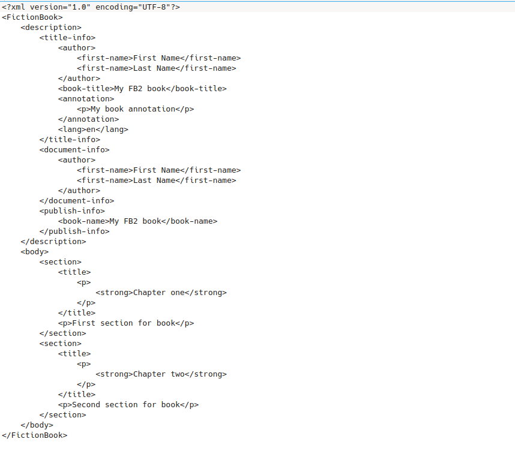

# Класс для создания книг формата FB2

```
composer require nigo/fb2-book
```

## Пример использования

```php
<?php

require_once 'vendor/autoload.php';

use Nigo\Fb2Book\Fb2Book;

$fb2book = Fb2Book::make()
    ->setTitle('My FB2 book')
    ->setAuthor('First Name', 'Last Name', 'Middle Name', 'Nickname')
    ->setTranslator('Translator First Name', 'Translator Last Name')
    ->setAnnotation('My book annotation')
    ->setBookLang('en')
    ->setGenre('prose_contemporary')
    ->setDate('2026', '2026-01-01')
    ->setSequence('My Book Series', 1)
    ->setDocumentInfo('my-fb2-book', 1)
    ->setPublishInfo('Publisher Name', 'City Name', 2026, '978-0-000000-0-0')
    ->addSection('First section for book', 'Chapter one')
    ->addSection('Second section for book', 'Chapter two');

$xmlBook = $fb2book->create();

echo $xmlBook;
$fb2book->save('./fb2-book.fb2');
```

## Результат


