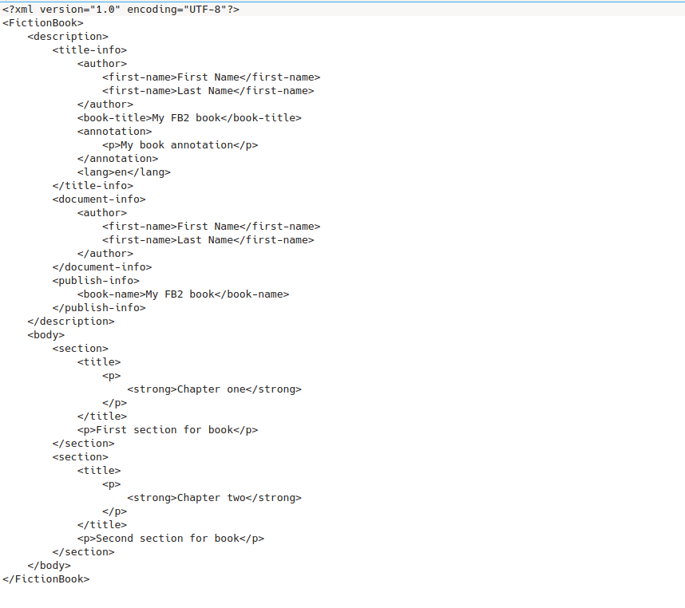

# Класс для создания книг формата FB2

```
composer require nigo/fb2-book
```

## Пример использования

```php
<?php

require_once 'vendor/autoload.php';

use Nigo\Fb2Book\Fb2Book;

$fb2book = new Fb2Book();

$xmlBook = $fb2book->setTitle('My FB2 book')
    ->setAuthor('First Name', 'Last Name')
    ->setAnnotation('My book annotation')
    ->setBookLang('en')
    ->addSection('First section for book', 'Chapter one')
    ->addSection('Second section for book', 'Chapter two')
    ->create();

echo $xmlBook;
```

## Результат

